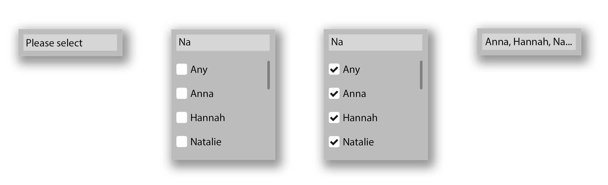

# Task

Разработать React компонент, позволяющий производить множественный выбор.


**Состояния**

- **Свернутое состояние.** Компонент выглядит как кнопка. Если ничего не выбрано, то на ней отображается текст: "Please select", иначе перечисленные через запятую выбранные элементы (кроме Any).
- **Развернутое состояние.** На месте кнопки появляется инпут. Снизу выпадает список чекбоксов, ограниченный по высоте и со скроллом. Список должен отображаться поверх всех элементов на странице.

**Переход между состояниями**

- Разворачивание списка происходит по клику по кнопке, при этом фокус переходит на инпут.
- Сворачивание списка происходит по клику вне компонента или при нажатии на Enter, когда инпут в фокусе. После сворачивания текст в инпуте сбрасывается.

**Фильтрация**
Чекбоксы фильтруются по введенному в инпут тексту. Чекбокс Any отображается в списке всегда.

**Чекбоксы**

- Чекбоксы должны быть уникальными и сортироваться в алфавитном порядке. Any всегда первый.
- [] Any отмечен только если выбраны все чекбоксы.
- [] При нажатии на чекбокс Any, если он не отмечен выбираются все чекбоксы, иначе - сбрасываются.

**Результат**
Нужно отобразить на странице несколько компонентов друг под другом. Если отметить чекбоксы в одном из компонентов, то в других они тут же отмечаются. Другие состояния независимы.

**Данные**

```
["Oliver", "Evelyn", "William", "Emma", "James", "Ava", "Benjamin", "Sophia", "Lucas", "Isabella", "Henry", "Mia", "Alexander", "Charlotte", "Michael", "Amelia", "Ethan", "Harper", "Daniel", "Ella", "Matthew", "Avery", "Aiden", "Abigail", "Joseph", "Emily", "Samuel", "Elizabeth", "Sebastian", "Sofia", "Mason", "Eleanor", "David", "Madison", "Nicholas", "Chloe", "Josephine", "Grace", "Leo", "Hannah", "Adam", "Lily", "Andrew", "Addison", "Liam", "Natalie", "Anthony", "Aria", "Dylan", "Audrey", "Caleb", "Scarlett", "Elijah", "Victoria", "Isaac", "Aurora", "Nathan", "Layla", "Noah", "Penelope", "Owen", "Stella", "Ryan", "Lucy", "Gabriel", "Ellie", "Julian", "Lila", "Christian", "Leah", "Wyatt", "Zoe", "Eli", "Aaliyah", "Thomas", "Anna", "Charles", "Katherine", "Harrison", "Lillian", "Jackson", "Claire", "Isabelle", "Audrey", "George", "Nora", "Finn", "Ruby", "Lincoln", "Sadie", "Hunter", "Alice", "Miles", "Camila", "William", "Hazel", "Emma", "Avery", "Nathan", "Aubrey"]
```

# Getting Started with Create React App

This project was bootstrapped with [Create React App](https://github.com/facebook/create-react-app).

## Available Scripts

In the project directory, you can run:

### `npm start`

Runs the app in the development mode.\
Open [http://localhost:3000](http://localhost:3000) to view it in the browser.

The page will reload if you make edits.\
You will also see any lint errors in the console.

### `npm test`

Launches the test runner in the interactive watch mode.\
See the section about [running tests](https://facebook.github.io/create-react-app/docs/running-tests) for more information.

### `npm run build`

Builds the app for production to the `build` folder.\
It correctly bundles React in production mode and optimizes the build for the best performance.

The build is minified and the filenames include the hashes.\
Your app is ready to be deployed!

See the section about [deployment](https://facebook.github.io/create-react-app/docs/deployment) for more information.

### `npm run eject`

**Note: this is a one-way operation. Once you `eject`, you can’t go back!**

If you aren’t satisfied with the build tool and configuration choices, you can `eject` at any time. This command will remove the single build dependency from your project.

Instead, it will copy all the configuration files and the transitive dependencies (webpack, Babel, ESLint, etc) right into your project so you have full control over them. All of the commands except `eject` will still work, but they will point to the copied scripts so you can tweak them. At this point you’re on your own.

You don’t have to ever use `eject`. The curated feature set is suitable for small and middle deployments, and you shouldn’t feel obligated to use this feature. However we understand that this tool wouldn’t be useful if you couldn’t customize it when you are ready for it.

## Learn More

You can learn more in the [Create React App documentation](https://facebook.github.io/create-react-app/docs/getting-started).

To learn React, check out the [React documentation](https://reactjs.org/).
